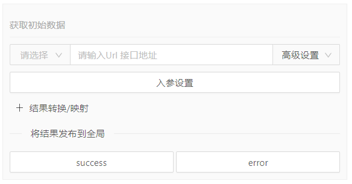
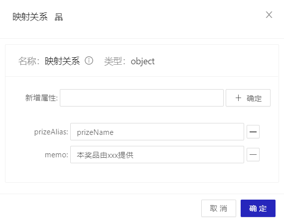

## Api

- [Api](#api)
  - [Api分类](#api分类)
  - [Api配置](#api配置)
    - [请求头](#请求头)
    - [入参设置](#入参设置)
    - [结果转换/映射](#结果转换映射)
    - [数据映射转换 {{}}的数据源为"输入要转换的元数据"](#数据映射转换-的数据源为输入要转换的元数据)
    - [将结果返回到运行时](#将结果返回到运行时)

### Api分类
  **api可在分为两类Api**
  - 第一类：预置数据，要预先为应用准备数据（比如我要为抽奖项目预先准备奖品数据），那么请在 ***页面 > 页面设置 > 初始化Api*** 中配置您的api
    
  
  - 第二类：与组件强关联的内部运行事件处理Api（比如抽奖组件点击抽奖的api），请选择   ***组件 > 设置 > Api*** 进行配置
    

**Api的数据源为Api请求返回结果**
  - 通过动态引用数据，数据源来源于Api返回结果。
  - Api请求成功时最终返回结构为
  ```javascript
    {
      response: {} // api 原始返回结果 successPublish > {{response.xxx}} 或 js{{response.xxx}} 
      [keys]: value // 数据映射转换结果
    }
  ```
  - Api请求失败时源数据结构返回


### Api配置
  无论是页面还是组件，同时有设置API **请求方法** 和 **url地址** 时，API才能在事件流中被调用。
  
  #### 请求头
  <br/>
  请求行由请求方法、URL地址、高级设置组成
  1. 请求方法：GET、POST、DELETE、PUT
  2. URL地址，设置当前请求的Url
  3. 高级设置，高级设置可以配置当前请求头部信息：mode、headers、credentials
  #### 入参设置 
  主动传参时，参考参数配置<br />
  <br />
  被动接受参数时可以通过 **入参转换/映射** 将上被动接受的原数据转换为Api所需要的参数，具体参考数据映射转换<br />
  <br />
  #### 结果转换/映射  
  结果转换/映射是将Api返回数据转换为所需要的数据，当Api返回数据结构与模块所需要的数据结构不一致时，可以通过字段映射用来调整成满足组件使用的数据结构，（这里仅做名称的调整，数据结构与要求相差太大时尽量调整Api）具体参考数据映射转换<br />
  <br />
  #### 数据映射转换 {{}}的数据源为"输入要转换的元数据"
  数据映射转换是将旧数据转换为一个新的数据，**数据类型与源数据类型保持一致**<br />
    
  <br />

  Eg：比如我们要将旧数据中的是user转换为memberInfo新数据中的memberInfo
  <br />
  源数据
  ```json
    {
      "response": {
        "data": {
          "prizeinfos": [
            {
              "prizeName": "一等奖",
              ...
            }
          ]
        }
        ...
      },
    }

  ```
  设置映射关系{foo:bar} foo是新数据key，bar是旧数据key，通过编辑 
  <br />
  转换后的新数据将如下<br />
  ```json
    {
      "response": {
        "data": {
          "prizeinfos": [
            {
              "prizeName": "一等奖",
              ...
            }
          ]
        }
        ...
      },
      "prizeinfos": [
        {
          "prizeAlias": "一等奖",
          "memo": "本奖品由xxx提供"
        }
        ...
      ]
    }
  ```
  **注意：**
  <br />1.映射源数据与目标数据指定数据时，无需用“{{}}”来包裹；
  <br />2.映射数据将从数据源中取值，如果没有没有数据时则以字符串来显示；
  <br />3.映射的新数据值，可以通过{{}}取值先匹配上游数据，如果上游没有数据将匹配运行时全局数据；
  <br />4.```js{{ }}```可以执行简单脚本。<br />js{{}}内部通过this可以获取上下文数据<br /> ``` js{{ this.data > 60 "合格" : "不合格" }} ```；<br />数据源优先匹配上游数据，如果上游没有数据将匹配运行时全局数据；
  <br />
  <br />
  Eg：假如运行时的search.title="xxx",当映射关系如下图设置时，将会返回如下数据
  <br />
  ```json
    {
      "prizeAlias": "一等奖",
      "memo": "本奖品由xxx提供"
    }
  ```

  #### 将结果返回到运行时
  通过此功能可以把Api请求数据成功或失败的结果返回到运行时中供下游使用<br />
  <br />