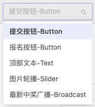
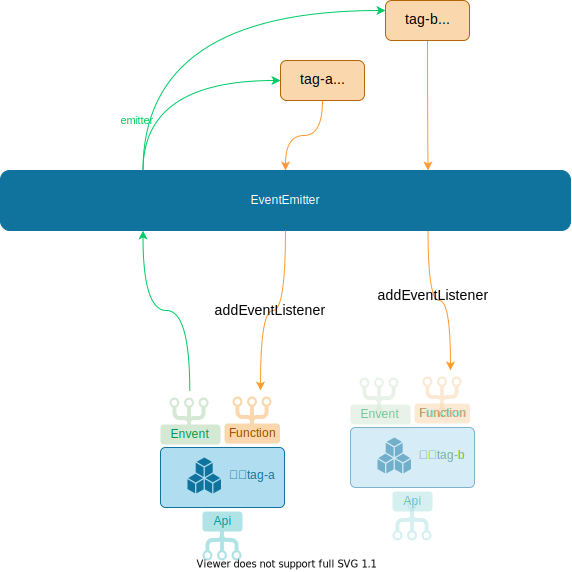

## 编辑器

编辑器包含 事件、样式、api的编辑

我们在编辑视图内点取任意组件,即可打开编辑面板如下图:

编辑面板窗口的顶部菜单有

- [编辑器](#编辑器)
  - [组件名称](#组件名称)
  - [设置](#设置)
  - [样式](#样式)
  - [code(组件数据视图)](#code组件数据视图)
  - [其他工具(查看运行时变量,复制,删除)](#其他工具查看运行时变量复制删除)


---
### 组件名称
组件名展示的是当前编辑的组件名称,它是一个下拉选项,子选项是当前编辑视图内包含的所有组件;

除了在编辑视图内选取要编辑的组件,也可以通过下拉快速切换要编辑的组件.



---
### 设置

选择设置面板


设置选项是对组件的事件方法与Api设置,面板包含了 "预设"、"事件"、"Api",其中
- 预设
  
  预设是事件的一部分,其实质就是对组件初始化事件(mount)的快捷设置,默认组件所有暴露出来的方法都会在这里显示,但是有些设置过于复杂,或者某种业务原因(比如抽奖方法)我们并不希望在预设中显示可以通过组件的配置文件`Component.config.ts`的属性`presettable=false`来关闭

    ```javascript
        exporsFunctions: [
            ...
            {
                name: 'lottery',
                description: '抽奖',
                presettable: false,
                arguments: [],
            },
            ...
        ]
    ```

- 事件
  
  像`window.addEventListener`或者`node.eventEmitter`一样,yugong也有一套自己的事务管理方案, “事件”是`eventEmitter`的可视化编辑,我们把组件的每个方法交由`eventEmitter`管理,所有事件都由他分发; 每个组件在创建之时都会有一个独立的`uuid`,yugong会以此为标识在运行时保存了所有的实例组件的方法,通过`eventEmitter`订阅事件去关联任何组件(或全局)的方法,事件被触发时将会调用对应关联的方法;

  事件配置就是用于建立起,组件之间相互通信的方法.比如A组件的某一事件要调用B组件的方法,那么就要在A组件的事件面板上配置好B组件的方法与参数.

  

---
### 样式
### code(组件数据视图)
### 其他工具(查看运行时变量,复制,删除)