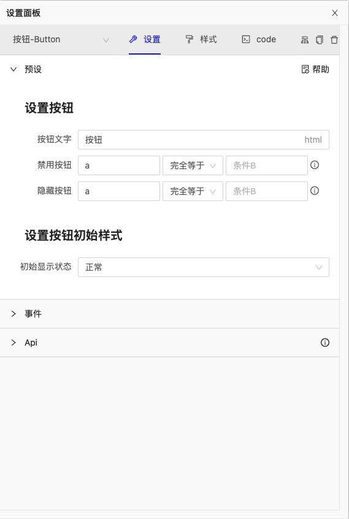
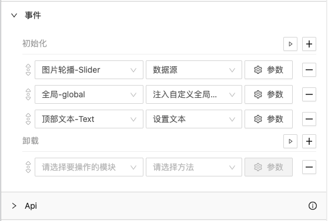
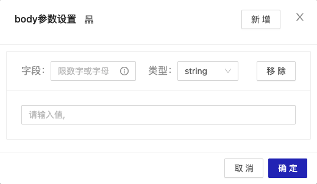
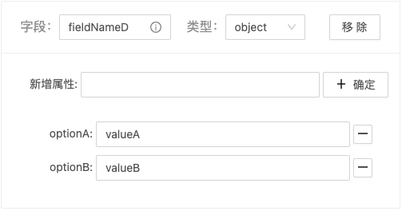
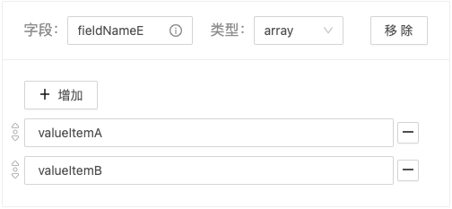
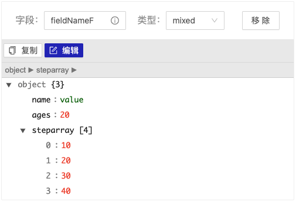
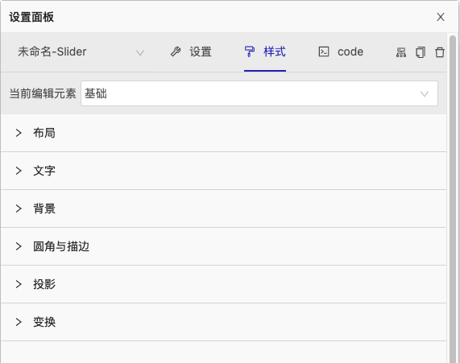
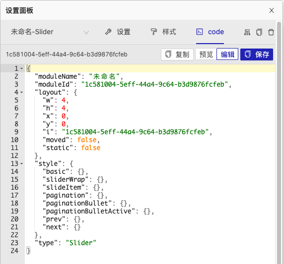

## 编辑器

编辑器包含 事件、样式、api的编辑

我们在编辑视图内点取任意组件,即可打开编辑面板如下图:

编辑面板窗口的顶部菜单有


  - [组件名称](#组件名称)
  - [设置](#设置)
  - [事件面板](#事件面板)
  - [参数面板](#参数面板)
  - [样式](#样式)
  - [code(组件数据视图)](#code组件数据视图)
  - [其他工具(查看运行时变量,复制,删除)](#其他工具查看运行时变量复制删除)




---
### 组件名称
组件名展示的是当前编辑的组件名称,它是一个下拉选项,子选项是当前编辑视图内包含的所有组件;

除了在编辑视图内选取要编辑的组件,也可以通过下拉快速切换要编辑的组件.


---
### 设置

选择设置面板


设置选项是对组件的事件方法与Api设置,面板包含了 "预设"、"事件"、"Api",其中
- 预设
  
  预设是事件的一部分,其实质就是对组件初始化事件(mount)的快捷设置,默认组件所有暴露出来的方法都会在这里显示,但是有些设置过于复杂,或者某种业务原因(比如抽奖方法)我们并不希望在预设中显示可以通过组件的配置文件`Component.config.ts`的属性`presettable=false`来关闭

    ```javascript
        exporsFunctions: [
            ...
            {
                name: 'lottery',
                description: '抽奖',
                presettable: false,
                arguments: [],
            },
            ...
        ]
    ```

- 事件
  
  像`window.addEventListener`或者`node.eventEmitter`一样,yugong也有一套自己的事务管理方案, “事件”是`eventEmitter`的可视化编辑,我们把组件的每个方法交由`eventEmitter`管理,所有事件都由他分发; 每个组件在创建之时都会有一个独立的`uuid`,yugong会以此为标识在运行时保存了所有的实例组件的方法,通过`eventEmitter`订阅事件去关联任何组件(或全局)的方法,事件被触发时将会调用对应关联的方法;

  事件配置就是用于建立起,组件之间相互通信的方法.比如A组件的某一事件要调用B组件的方法,那么就要在A组件的事件面板上配置好B组件的方法与参数.

  

### 事件面板

展开事件面板,任何yugong组件至少包含有“初始化”和“卸载”两个事件,除此之外在组件的生命周期内还会暴露一些个性的事件



- 点击`play`图标,即可手动执行已添加事件,编辑时有的事件(初始化)是不可逆的,点击此按钮可以手动执行当前事件下配置的模块方法,常用于检查事件配置是否正常;

    

- 点击`+`图标即可为当前事件新增一项配置;

    

    配置项由左到右分别有”排序按钮↕️“、“模块选择”、“模块方法选择”、“参数设置按钮”、“移除按钮”;

    - 排序按钮:拖动可以排序当前事件下的配置项;
    - 模块选择:用于选择要操作的组件(即被创建到编辑器内的所有组件将列入到下拉选项),我们可以通过下拉选择当前事件要作用的组件
  
        > 除了所有被创建的组件之外,下拉选项中还有一个“全局-gloab”的全局模块选项用于改变全局内容

    - 模块方法选择: 方法选择的选项受制于模块选择,当模块被选择,方法选择下拉选项包含被选组件的了全部方法;
    - 参数设置:参数设置受制于前两项的选择,它是对模块方法的参数设置,每个方法有不同的参数设置,点击按钮即可打开[参数设置面板](),我们下文会重点介绍;

    **到此我们已经完成通过一个模块事件调用其他任何一个或多个模块并配置方法与参数了**


### 参数面板

在页面事件和组件事件中我们都会要对定义的方法设置参数,Api也会对他设置参数.点击参数按钮即可打开参数面板;



我们以yugong的Api入参设置为例,打开面板如上图所示,点击左上角`增加`按钮即可添加参数.添加的参数都可以通过移除按钮将其移除;
yugong的参数包含有`string`,`number`,`boolean`,`object`,`array`,`mixed`,`runningtime`;

- **string**
  
  

  当类型选择为字符类型时,参数将被定义为字符类型,yugong有一套自身的数据描述来配置参数,其中字符串是这样描述的

  ```javascript
    {
        name: "名称",
        fieldName: "fieldNameA",
        describe: "字段描述",
        type: "string",
        data: "value",
    }
  ```

- **number**
  
  

  数字类型与字符类似

  ```javascript
    {
        name: "名称",
        fieldName: "fieldNameB",
        describe: "字段描述",
        type: "number",
        data: "100",
    }
  ```

- **boolean**
  
  

  boolean类型的描述类似下面,这里的描述将会返回`{{windowSize.ww}} > 375`的表达式;

  > `{{windowSize.ww}} > 375`这里的"`{{}}`"用的是yugong的[表达式规则](./../script/README.md)

  ```javascript
    {
        type: "boolean",
        name: "名称",
        fieldName: "fieldNameC",
        describe: "字段描述",
        data: {
            comparableAverageA: "{{windowSize.ww}}",
            comparableAverageB: 375,
            method: ">",
        },
    },
  ```

- **object**
  
  

  对象类型可以通过`+确定`来新增属性,描述内容如下

  ```javascript
    {
        type: "object",
        describe: "字段描述",
        name: "名称",
        data: {
            optionA: "valueA",
            optionB: "valueB",
        },
        fieldName: "fieldNameD",
    },
  ```

  最终解析的结果将是 
  
  `{optionA: "valueA",optionB: "valueB"}`

- **array**
  
  

  数组类型将返回一个数组, 通过点击增加可以为数组添加子项

  ```javascript
    {
        type: "array",
        name: "名称",
        describe: "字段描述",
        data: [
            'valueItemA',
            'valueItemB'
        ],
        fieldName: "fieldNameE",
    }
  ```

- **mixed**
  
  

  混合类型允许自由编辑数据内容,但是不支持`{{}}`脚本规则,点击“编辑”按钮可以编辑数据,编辑完成后请点击“保存”按钮

- **runningTime**
  
  

  运行时类型,允许将全局运行时的某一个数据作为参数,选择runningTime类型的时候runningTime的下一级数据将会以下拉菜单的形式展示在下面供选择;与mixed相同,runningTime也不支持`{{}}`脚本参数

---


### 样式



样式编辑面板可以对选择组件的Dom元素的`布局`,`文字`,`背景`,`圆角与描边`,`投影`,`变换`进行编辑,我们将在[样式](./../styles/README.md)介绍中详细描述;


### code(组件数据视图)



code面板主要是用于快捷查看当前组件数据配置情况,他能反应当前组件的全部数据配置情况,当然也可以在在这里做一些快捷编辑;

> 可以在这里快捷编辑组件但不建议这么做,除非你足够了解yugong,因为这样处理很容易出错;

**数据有复制按钮,但是要注意这里是对组件完整数据的复制,不建议使用,因为每个组件都有自身的唯一的moduleId和各自独立的事件引用关系,这些是不可复用的**

### 其他工具(查看运行时变量,复制,删除)

三个功能按钮,第一个图标点击可以查看当前运行时的数据,其次是复制按钮使用复制按钮时要注意事件方法引用关系的处理,删除按钮可以删除组件