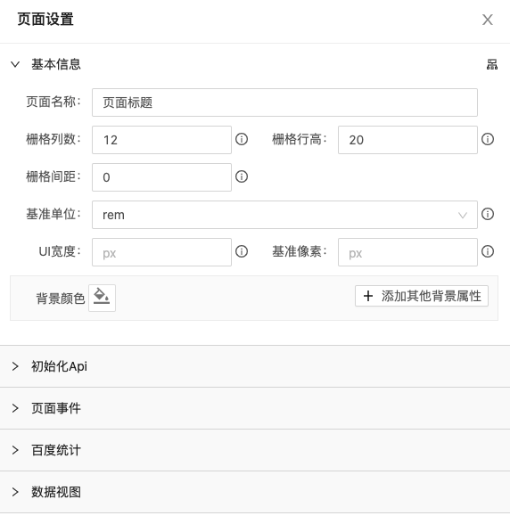

## 页面

为了呈现所见即所得的编辑，yugong将页面独立处理，访问项目可以通过页面+模板id （如：http://localhost:3000/?tpl=12  ）访问,而在编辑模式下这个链接同样是由一个iframe引入到编辑器中，**页面数据与编辑器数据完全隔离，内外通过postmessage安全通信**，通过message约定来同步编辑器与页面的数据，达到真正意义上的所见即所得；

具体流程：
1. 获取url模板id参数
2. 如果没有模板参数则读取本地缓存模板数据，或创建新页面
3. postmessage发布模板数据信息
4. 准备页面数据 解析页面数据，（页面配置与组件数据）
5. 初始化[页面配置](#页面配置)
6. 渲染页面与组件

---

### 页面配置
页面配置用于配置项目的通用环境和公共功能部分的始化数据配置。

进入编辑器从顶部菜单中点击“页面”按钮即可打开页面编辑面板

+ 基本信息
  > 基本信息包含页面标题、栅格数据、单位与背景样式
    - **页面名称** 
        
        用于设置页面的标题，这里可以通过脚本规则在页面运行时中获取或计算。

    - **栅格列数、栅格行高、栅格间距**

        页面栅格的列数，这里决定页面的编辑粒度，yugong编辑器是基于[react-grid-layout](https://github.com/react-grid-layout/react-grid-layout)来进行拖拽编辑的，遵循栅格布局标准；当栅格列数越大，栅格行高越小，可编辑的粒度也就越大，当然根据实际需求来定义
        
        > 栅格间距通常不建议设置，但有必要时也可以通过栅格间距来设置栅格之间的间隙，相对定位下栅格间隙内是不能存放内容的；
        
        这里也可以通过脚本规则在页面运行时中获取或计算

    - **基准单位**

        页面的基准单位.
        px: 页面将直接以px返回单位
        rem: 在移动端时我们用rem单位来做适配,当我们设置为rem时需要设置UI宽度和基准像素,用于单位换算,最终按比例以像素为单位将计算结果运行到到客户端

        > UI设计下，1rem=1基准像素

    - **背景颜色**
  
        用于页面背景设置,可以设置页面的背景颜色/图片等; 请参考[背景样式设定](./../styles/README.md)

 + 初始化Api

    页面初始化时将调用这里配置的Api,常用于全局数据的初始化(Api请求数据,再把数据发布高运行时供下游数据模块使用,具体查看[Api设置](./../apiConfig/README.md))

 + 页面事件

    与所有组件一样页面也包含初始化与卸载事件, 具体查看[事件](./../eventConfig/README.md)

    - 初始化事件
    
      在页面的生命周期中,页面的初始化时做了如下工作

      1. 处理初始化Api,当配置有初始化Api时页面将逐个请求
      2. 逐个处理初始化事件

    - 卸载事件

      卸载页面时逐个执行配置内容

  + 百度统计
  
      可以配置百度统计账号,对页面进行数据统计,配置后将在在进入页面即初始化百度统计代码

  + 数据视图

      用于查看当前页面的模板数据结构

### 全局方法

  与组件相同页面也向全局提供方法,用于操作全局数据或公共工具, 具体查看[事件](./../eventConfig/README.md)

  + 注入自定义全局数据
  + 等待
  + 页面重定向
  + 百度页面统计
  + 百度事件统计
  + 消息广播