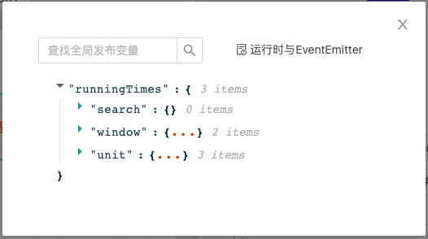
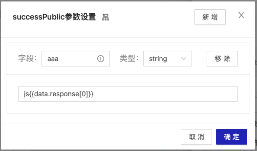

## 语法与规则

### 运行时

运行时是app运行时的数据池,是一份全局数据,供运行环境任何可以引用的地方使用;

在页面面板右上角、设置面版右上角的、参数面板的左上角都能看到图标  点击即可以打开运行时面板:



运行时默认包含下面数据

+ search
  
  url上的search参数数据,比如页面url `http://xxx?prame1=1&prame2=2` 那么search的数据就如下

  ```json
    {
        "prame1": "1",
        "prame2": "2"
    }
  ```

+ windowSize
+ unit

### html语法标签

为了得到更为灵活的展现形式,在yugong中参数设置部分条目允许使用html标签;

**编辑条目末尾有`html`标示时说明当前条目支持`html`标签:** 


### {{}}取数规则

设置面板中`{{}}`用于在运行时中获取数据,当我们把故意设定的参数发布到运行时后,即可通过`{{}}`来获取运行时的数据;

比如`runningTimes`中有默认`window`的`width`值.

```javascript
    {
        "search": {...},
        "window": {
            "height": 736,
            "width": 414
        },
        "unit": {...}
    }
```

我们可以通过如下方式来获取:


> 这里要注意,`{{}}`的root数据之乡的是runningTimes,所以在写`屏幕宽度={{window.width}}`不用写成`{{runningTimes.window.width}}`,而且`{{}}`的取数规则也仅能取到runningTimes下的数据;

### js{{}}表达式规则 

js 表达式规则是通过[safer-eval](https://github.com/commenthol/safer-eval#readme)来实现的，为了安全起见，运行上下文context仅仅包含了`{runningTimes, dayjs, data(Api提供的数据，仅在接口请求时存在)}`,用于处理简单的目运算，或其他数据的格式化等,比如用`dayjs`去格式化一个时间


也可以`js{{runningTimes.window.width <= 767 ? '移动设备' : '非移动设备'}}`

我们在`js{{}}`表达式中的运行上下文context包含数据`{runningTimes,dayjs,data}`,在Api设置中`data`是接口返回的上下文,我们可以通过`js{{data.response}}`或者`js{{this.response}}`来获取;

> 这里的`this`指向的是`data`

