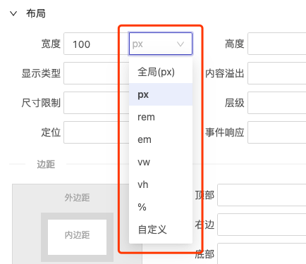
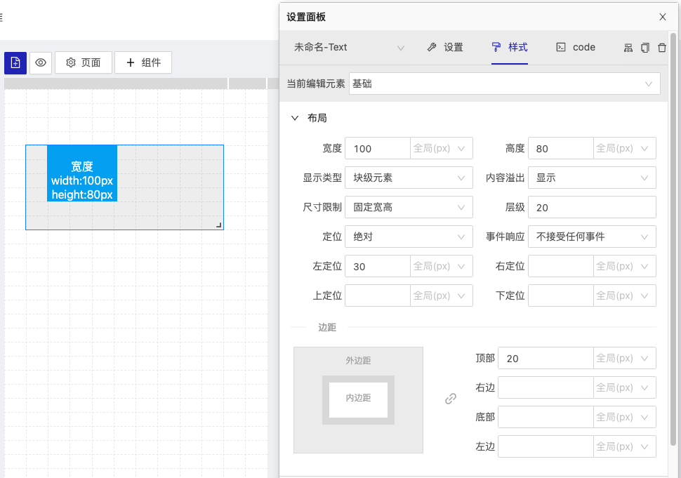
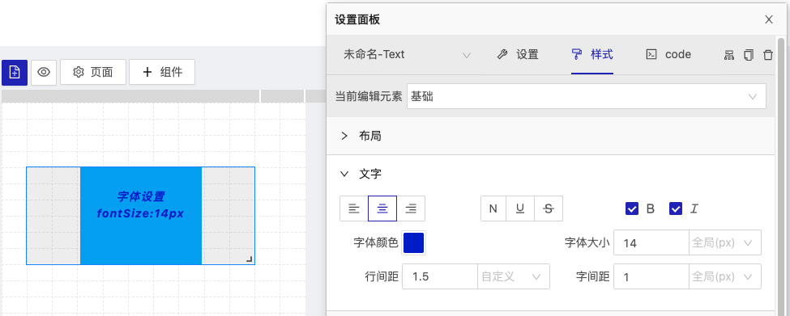
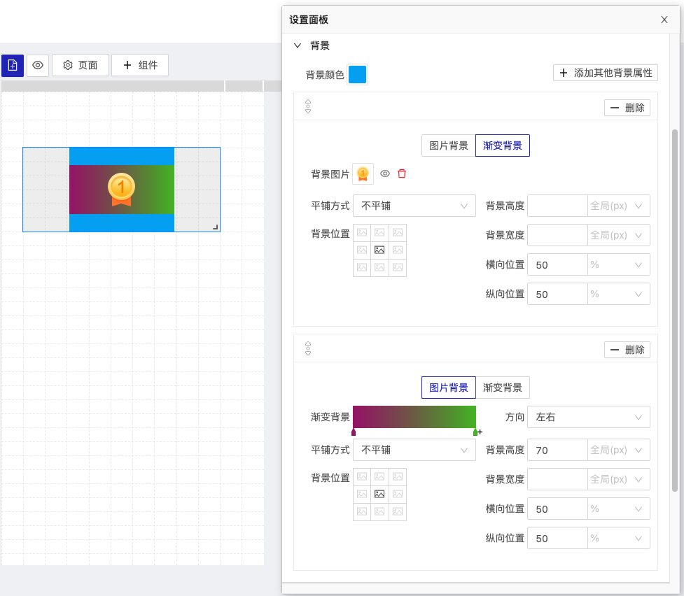
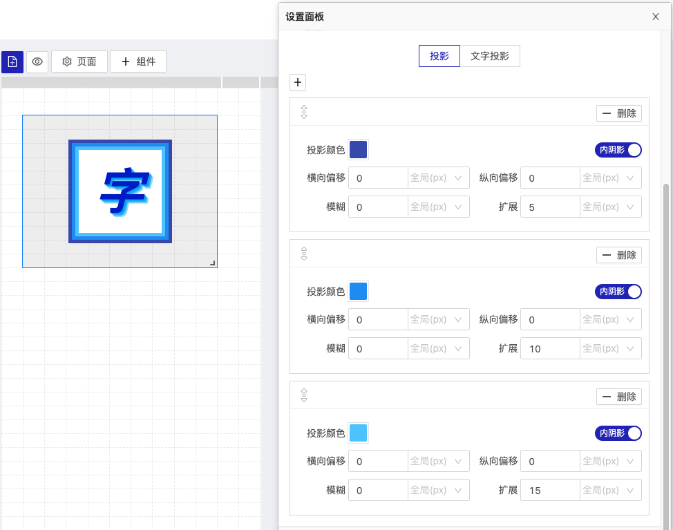

## 样式

### 实现原理与规则

yugong 对style的处理流程如下


1. 先由组件编辑器编辑组件样式;
2. 然后将组件样式转换为驼峰样式数据;
3. 再由[jss](https://cssinjs.org)转换为文档样式,并将样式注入到页面中;

yugong将样式抽象为`布局`,`文字`,`背景`,`圆角与秒变`,`投影`,`变换`六大块,基本归纳了大部分常见的css属性;

**yugong将样式中数值与单位分开独立存贮,做到数据可以随时进行进制转换,单位可以根据需求完全自定义**

比如下面这个布局样式`width: [ 100, null]`数组的定一个值代表数值,第二个值代表单位,
- 当单位值为`null`时使用的是全局单位,也就是我们在[页面设置](./../page/README.md)中定义的基准单位,最终yugong会将数值转换为基准单位下的px值输出到页面中;
  
- 单位值也可以是直接单位,比如`height: [ 50, 'vh' ]`,当有定义数值的单位时,样式转换器将会按照原值输出为`height: 50vh`;

```javascript
    "display": {
        "width": [ 100, null ],
        "height": [ 50, 'vh' ],
        "padding": [
          [ 24, null ],
          [ 24, null ],
          [ 24, null ],
          [ 24, null ]
        ],
        "margin": [
          [ 30, null ],
          [ 30, null ],
          [ 30, null ],
          [ 30, null ]
        ]
      }
```

在每个要求单位的样式属性属性后面都有一个“单位”的下拉选择框



当我们选择“自定义”时我们可以填写除数值以外的任何值,比如:


将会被解析为`width: ["unset", "-"]`

---

编辑面板功能介绍

### 1.选择编辑元素


通过这里选择当前组建要编辑的Node元素,这里的样式排序层级是由组件的`Component.config.ts`的 `styleDescription`来描述的,他与`style`样式的值一一对应;

```javascript
  ...
  style: {
      // 基础
      basic: {},
      // 滑动包裹器
      sliderWrap: {},
      // 导航
      pagination: {},
      ...
  },
  styleDescription: [
      {
        title: "基础",
        value: "basic",
        children: [
          {
            title: "包裹器",
            value: "sliderWrap",
            children: [
              {
                title: "滑动页",
                value: "slideItem",
              },
              {
                title: "导航条",
                value: "pagination",
              },
              ...
            ],
          },
        ],
      },
  ]
  ...
```

### 2.布局

对组件被选择Node元素的布局定义,包含`width`,`height`,`dispaly`,`overflow`,`boxSizing`,`padding`,`margin`,`zIndex`,`position`,`left`,`right`,`top`,`bottom`,`pointerEvents`等样式属性

如下图我们定义一个文字组件的基础节点:



解析成样式将会是:

```
  {
    ...
    width: 100px;
    height: 80px;
    box-sizing: border-box;
    padding: 20px 0px 0px;
    display: block;
    overflow: visible;
    z-index: 20;
    position: absolute;
    left: 30px;
    pointer-events: none;
    ...
  }
```

### 3.文字

对组件被选择Node元素的文字定义`textAlign`,`color`,`lineHeight`,`fontWeight`,`fontStyle`,`fontSize`,`letterSpacing`;



解析成样式将会是:

```
  {
    ...
    text-align: center;
    color: rgb(0, 29, 205);
    line-height: 1.5;
    font-weight: bold;
    font-style: italic;
    font-size: 14px;
    letter-spacing: 1px;
    ...
  }
```

### 4.背景

背景包含背景色,图片背景,渐变背景;css属性包含`background`的全部缩写功能;

> 除了背景色,其他背景属性可以多个叠加,点击`+ 添加其他背景属性`来追加一条新的背景规则,拖动↕️上下滑块可以排序背景规则.



解析成样式将会是:

```
  {
    ...
    background: url(https://xxx.png) 50% 50% / auto no-repeat, -webkit-linear-gradient(left, rgb(159, 20, 112) 1%, rgb(75, 188, 41) 100%) 50% 50% / auto 70px no-repeat rgb(3, 169, 244);
    ...
  }
```

### 5.圆角与描边

对组件被选择Node元素的边框和圆角的定义,css属性包含`border-radius`,`border`


解析成样式将会是:

```
  {
    ...
    background-color: rgb(3, 169, 244);
    border-radius: 30px;
    ...
  }
```

### 6.投影

投影包含阴影



```
  {
        box-shadow: rgb(63 81 181) 0px 0px 0px 5px inset, rgb(33 150 243) 0px 0px 0px 10px inset, rgb(86 202 255) 0px 0px 0px 15px inset;
  }
```