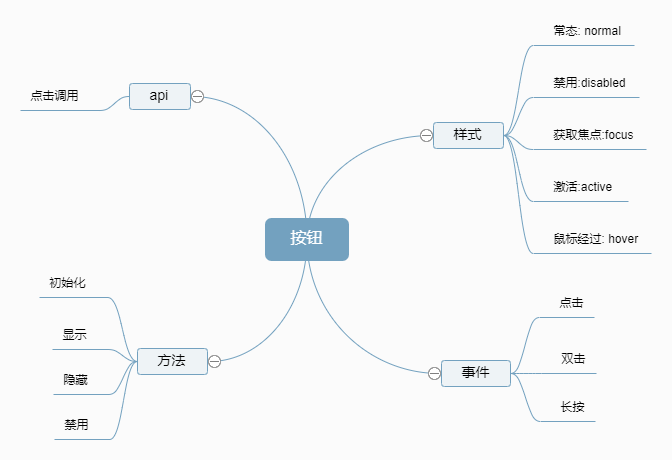
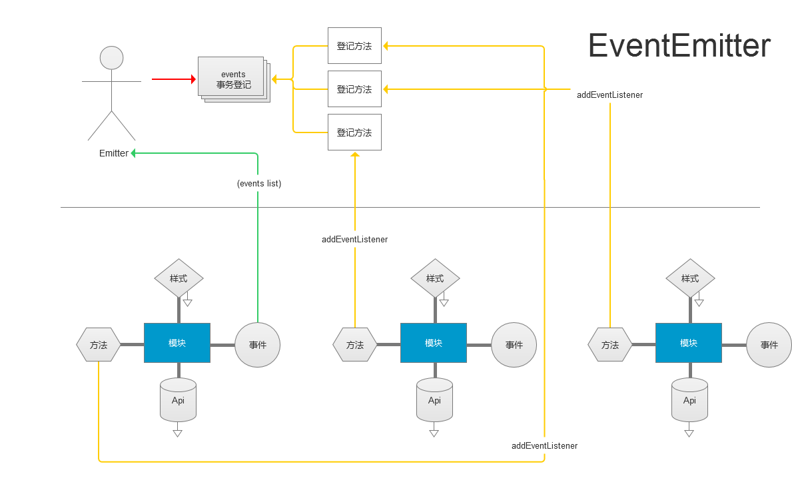

## 设计一个按钮module
- ### module结构
  首先需要注意，一个独立module包含四大属性，其分别是
  1. Api：(接口) 负责数据准备与共享

  2. style：(样式) 用于处理module的UI视觉。

  3. functions：(方法) 用于处理module内部工作流。

  4. events：事件 用于执行方法(functions)的事件，每个module至少必须包括mount(挂载)与unmount(卸载)两个生命周期必要事件，用于初始或卸载module。   
    ```typescript
        Button.exposeEvents = [
            {
                name: 'mount',
                description: '挂载',
            },
            {
                name: 'unmount',
                description: '卸载',
            }
        ];
    ```
    根据按钮的应用场景与上述规则我们来分析一个按钮的结构。
    

    - 发布事件
    **发布事件是为了通过当前module事件来执行任何module发布的方法或获取自身定义的Api数据**
    
    首先从事件上说按钮包含点击、双击、长按等其他事件(这里我们可以关注最常用的这三个事件)。
    ```typescript
        Button.exposeEvents = [
            {
                name: 'mount',
                description: '挂载',
            },
            {
                name: 'click',
                description: '点击',
            },
            {
                name: 'doubleClick',
                description: '双击',
            },
            {
                name: 'longPress',
                description: '长按',
            },
            {
                name: 'unmount',
                description: '卸载',
            }
        ];
    ```
  
  - 其次定义方法，明确方法执行时机。上面我们定义了事件包含mount(挂载)、click(点击)、doubleClick(双击)、longPress(长按)、unmount(卸载)。那么我们根据module的生命周期来定义将要发布的方法。      
    **设置按钮**
    我们需要定义一个方法来初始化按钮比如修改按钮的文本(buttonText)、定义按钮的当前状态(enable、disable) 是否隐藏按钮。   

    ```typescript
        Button.exposeFunctions = [
            {
                name: "setButton",
                description: "设置按钮",
                arguments: [
                    {
                        type: "string",
                        name: "按钮文字",
                        describe: "按钮显示文字",
                        data: "按钮",
                    },
                    {
                        type: "boolean",
                        name: "禁用按钮",
                        describe: "禁用按钮，true禁用，false启用",
                        data: {
                            comparableAverageA: undefined,
                            comparableAverageB: undefined,
                            method: "==="
                        },
                    },
                    {
                        type: "boolean",
                        name: "隐藏按钮",
                        describe: "隐藏按钮，true隐藏，false不隐藏",
                        data: {
                            comparableAverageA: undefined,
                            comparableAverageB: undefined,
                            method: "==="
                        },
                    },
                ],
            },
        ];
    ```

    这个方法将随时被调用，用来调整按钮的状态。

    通常说来 **module发布方法的目的是为了通过事件调用module暴露的方法来修改module内部数据和状态**。

    关于module的事件与方法，都会通过顶层EventEmitter（事件流的处理器）来处理，工作流程如下图
    
    
    对于按钮来说setButton方法就够用了。接下来我们定义Api。

  - Api设置

    **Api是数据源，他将向服务器获取数据也可通过successPublic、errorPublic向全局全局运行时发布数据。**

    发布Api是非常灵活的，需要根据module需要来发布，执行时机，也根据需要安排。
    按钮的每一个事件其实都可以定义一个对应Api，当然的根据实际情况来定，不要过多定义，这样会使得module配置变得复杂。

    这里我们给按钮定义3个Api，如果有配置的话分别将在对应事件执行前执行。
    ```typescript
        Button.exposeApi = [
            {
                apiId: "beforeClick",
                name: "点击",
            },
            {
                apiId: "beforeDoubleClick",
                name: "双击",
            },
            {
                apiId: "beforeLongPress",
                name: "长按",
            },
        ];
    ```
  - style样式定义


